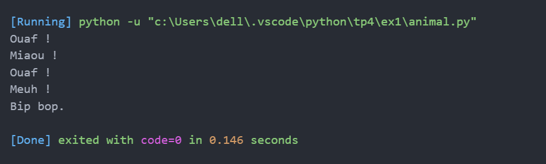
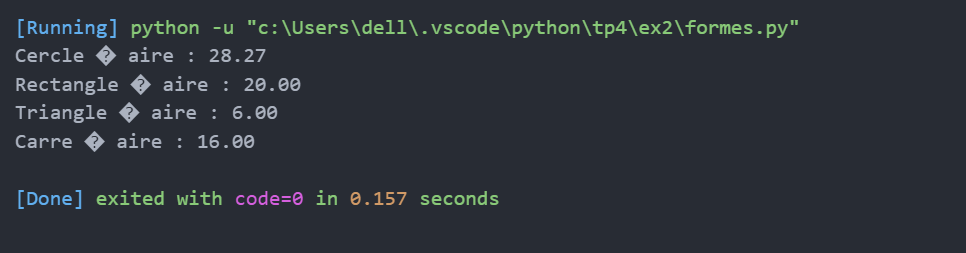
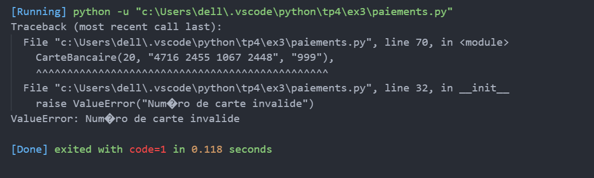

# TP4 : Polymorphisme en Python

---

## EXERCICE 1
**Titre :** Animaux  
**Description :** Méthode `parler()` commune pour plusieurs classes.  

**Screenshot :**  

---

## EXERCICE 2
**Titre :** Formes géométriques  
**Description :** Calcul d’aire via une classe abstraite et ses dérivées.  

**Screenshot :**  

---

## EXERCICE 3
**Titre :** Paiements  
**Description :** Interface de paiement et trois types polymorphes.  

**Screenshot :**  

---
